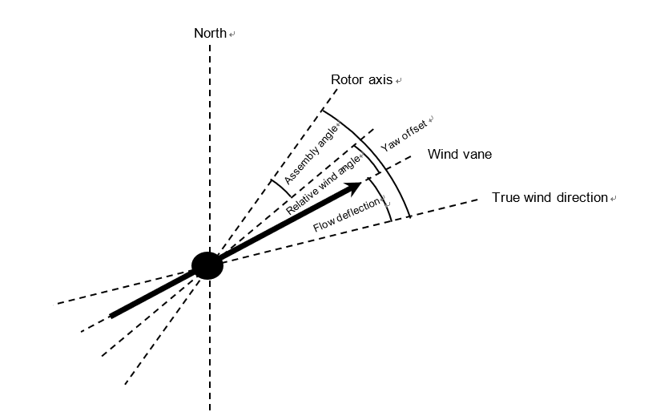

# Yaw misalignment calibrator of wind turbine

Inwoo Chung (gutomitai@gmail.com)


## 1. Concept

The power of a wind turbine can be optimized via calibrating yaw misalignment dynamically. In contrast with previous analytical and statistical rule-based models to calibrate yaw misalignment, using a deep learning based yaw misalignment calibrating model, yaw misalignment could be more accurately calibrated and then, the power can also be more optimized, because via the deep learning, direct factors to affect yaw misalignment are obtained and such direct factors calculate more accurate yaw misalignment. Here yaw misalignment is defined as the wind flow deflection factor among three main factors of yaw offset [1] as shown in Figure 1.



                                     Figure 1 Three main factors of yaw offset.

Yaw offset is the overall offset that should be calibrated. It is given as

                                                  γ=φ(to)+μ+δ(U∞Ω)

where γ is the yaw offset, φ(to) is the assembly angle in the first installation to a wind turbine, μ is the relative wind direction of a wind vane and δ(U∞Ω) is the wind flow deflection angle affected by U∞(wind velocity) and Ω(power of a wind turbine). In three factors of yaw offset, φ(to)+μ is obtained as an assembly angle calibrated relative window angle, so dynamic factors are φ(t) which is the assembly angle according to aging and δ(U∞Ω). By the way, I focus on yaw misalignment calibration for cases without assembly angle aging, and then the important and dynamic yaw misalignment factor is the flow deflection angle, so it can be defined as yaw misalignment.

I assume that the flow deflection is affected by a hidden factor sequence associated with the wind velocity and the power of a wind turbine, and the flow deflection in the future can be predicted with a previous flow deflection and the mean values of the wind velocity and a wind turbine’s power where since the mean values can be viewed as constant, they are omitted in the seq2seq2 model. Figure 2 shows the diagram of the yaw misalignment prediction seq2seq model.


                                   Figure 2 Yaw misalignment prediction seq2seq model.

To get the flow deflection angle from the relative wind angle in which the assembly angle is calibrated, the Kalman filter is used as follows.

                                                        δ=K(γ)
 
## 2. Yaw misalignment prediction model implementation

The yaw misalignment prediction model as the seq2seq2 model was developed and evaluated in the contest [2]. This contest provided SCADA data for each wind turbine and required the yaw misalignment prediction of 7 days. The contest’s problem statement described the yaw misalignment concept a little confusingly, so refer to this paper’s concept and [1] to define and understand the yaw misalignment concept. For training, from the SCADA dataset with the top 10% active power for each wind bin, the flow deflection dataset was extracted via Kalman filtering, and I judged that the assembly angle aging doesn’t affect the model, so I didn’t correct it. However, it must be corrected, and the selection of the SCADA dataset with the top 10% active power doesn’t matter, so using all SCADA data is preferred. Here the wind velocity is calibrated as given in [1]

                                                U∞=βo+β1ν+β2γ'+ε

where  βo, β1,  β2 are estimated regression coefficients, ε is the residual and  γ'is φ(t)+μ in our model.

As shown in Figure 2, I develop the seq2seq2 model using Keras and GRU, and with the dataset for the seq2seq2, the model was trained and evaluated where two sequence sizes are optional, so you can customize them. Moreover, to reduce training time, accelerating computing using multi GPUs and distributed computing using ipyparallel are applied.

## 3. Training guide.

The environments of Linux(Ubuntu 16.04.6 LTS), Anaconda 4.6.11, Python 3.6.8, Tensorflow 1.13.1 (Keras's backend), Keras 2.2.4 and on 8 CPUs, 52 GB memory, 4 x NVIDIA Tesla K80 GPUs are assumed.

### Install [Anaconda](https://docs.anaconda.com/anaconda/install/linux/).

### After installing Anaconda, create the environment.

```conda create -n tf36 python=3.6```

### Go to the created environment.

```conda activate tf36```

### Install necessary python packages.

```pip install tensorflow-gpu keras pandas ipyprallel```

### Download the yaw misalignment calibrator git repository.

```git clone https://github.com/tonandr/ymc.git```

### Train and test the model.
```cd ymc\src\space```
```python ymc --mode train_test --raw_data_path ../../resource --num_seq1 1008 --num_seq2 1008 --gru1_dim 128 --gru2_dim 128 --num_layers 4 --dense1_dim 128 --dropout1_rate 0.8 --lr 0.001 --beta_1 0.99 --beta_2 0.99 --decay 0.0 --epochs 1 --batch_size 64 --val_ratio 0.01 --model_load 0```

Hyper-parameters and neural network architecture information described above wasn’t applied in the practical training and evaluating procedure of the contest. You can optimize hyper-parameters and neural network architecture information.

## 3. Performance
In the contest, the performance is a square root of the average of the mean square error. The final score is max(0, (5 - rmse)/5 * 1,000,000). I received 920986.23 as the maximum score.


## 4. Conclusion

Yet, there is a bug, so it should be debugged. The SCADA data of this contest isn’t available. To test this model, I will enhance this model with open SCADA datasets. 

## Reference
### [1] Niko Mittelmeier and Martin Kuhn, 2018. Determination of optimal wind turbine alignment into the wind and detection of alignment changes with SCADA data.
### [2] [Yaw Alignment Marathon Challenge hosted by Topcoder, 2018.](https://www.topcoder.com/challenges/17323?tab=details)
 

